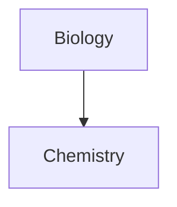

==DSKJDKS==

\*DKSJD \*
\*\*This line will not be bold\*\*
[MY NOTE](KDSH.COM)


 - [x] fdlsd
	 - [x] fdkf
	 - [x] fsdflsdf
 - [x] dksjd
	 - [x] kjfsd
 - [ ] ljdfk
	 - [ ] kjfd
	 - [ ] kfjd
- [ ] fdkj
 
- [ ] `````js
function fancyAlert(arg) {
  if(arg) {
    $.facebox({div:'#foo'})
  }
}
`````

`````js
function fancyAlert(arg) {
  if(arg) {
    $.facebox({div:'#foo'})
  }
}
`````
````md
Here's how to create a code block:
```js
console.log("Hello world")
```
````


````md
Here's how to create a code block:
```js
console.log("Hello world")
```
````

````md
```dataviewjs
dv.paragraph(`
~~~mermaid
graph TD
    A --> B
~~~
`)
```
````

This is a simple footnote[^1].

[^1]: This is the referenced text.
[^2]: Add 2 spaces at the start of each new line.
  This lets you write footnotes that span multiple lines.
[^note]: Named footnotes still appear as numbers, but can make it easier to identify and link references.
^[fk]df fdkjfk
[^ 3]
```md
[^1]: This is the referenced text.
```

[^1] fdkjf

[^2] fjdkf

[^4] fdjkf


[^1]:This is the referenced text.
[^1]: ffdlfk
[^2]: fdlkf
\~fl;d \~
| First name | Last name |
| ---------- | --------- |
| Max        | Planck    |
| Marie      | Curie     |

First name | Last name                                                                                                                 
| ---------- | ------------------------------------------------------------------------------------------------------------------------- |
Max | Planck                                                                                                                    
Marie | CurieFirst column \| Second column<br>-- \| --<br>[[Basic formatting syntax\|Markdown syntax]] \| ![[Engelbart.jpg\|200]] ```mermaid
sequenceDiagram
    Alice->>+John: Hello John, how are you?
    Alice->>+John: John, can you hear me?
    John-->>-Alice: Hi Alice, I can hear you!
    John-->>-Alice: I feel great!
```

$$
\begin{vmatrix}a & b\\
c & d
\end{vmatrix}=ad-bc
$$


$$
\begin{vmatrix}a & b\\
c & d
\end{vmatrix}=ad-bc
$$


This is an inline math expression $e^{2i\pi} = 1$.


dsds

```


This is an inline math expression $e^{2i\pi} = 1$.

$$
\begin{vmatrix}a & b\\
c & d
\end{vmatrix}=ad-bc
$$

global.MathJax = {
  loader: {
    paths: {
      mathjax: 'https://cdn.jsdelivr.net/npm/mathjax@4'
    }
  }
}
- [x] dslkd
- [ ] dsk
- [ ] fd

>[!note ] fdkljf

> [! kjfskdjf ] fdsjf fjksdjf
> [!note]


> [!note] fdf
> [!tip] Callouts can have custom titles
> Like this one.

> [!tip] Callouts can have custom titles
> Like this one.

> [!faq]- Are callouts foldable?
> Yes! In a foldable callout, the contents are hidden when the callout is collapsed.
> [!question] Can callouts be nested?
> > [!todo] Yes!, they can.
> > > [!example]  You can even use multiple layers of nesting.


.callout[data-callout="custom-question-type"] {
    --callout-color: 0, 0, 0;
    --callout-icon: lucide-alert-circle;
}

> [!failure]
> Lorem ipsum dolor sit amet

> [!example]
> Lorem ipsum dolor sit amet

> [!quote]
> Lorem ipsum dolor sit amet

[Callouts - Obsidian Help](https://help.obsidian.md/callouts)
---
tags:
  - recipe
  - cooking
---

```base
filters:
  and:
    - file.hasTag("example")
formulas:
  Untitled: ""
properties:
  file.basename:
    displayName: fdkjf
  file.backlinks:
    displayName: tets
views:
  - type: table
    name: Table
    order:
      - file.name
      - file.basename
      - file.backlinks
      - file.embeds
      - file.folder
      - file.fullname
      - tags
      - formula.Untitled
    sort:
      - property: file.name
        direction: DESC
      - property: file.folder
        direction: DESC
      - property: file.backlinks
        direction: ASC

```
